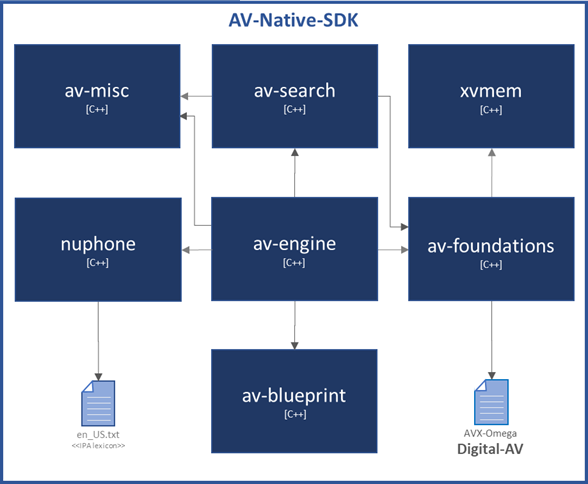
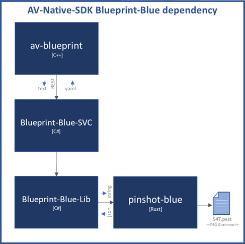
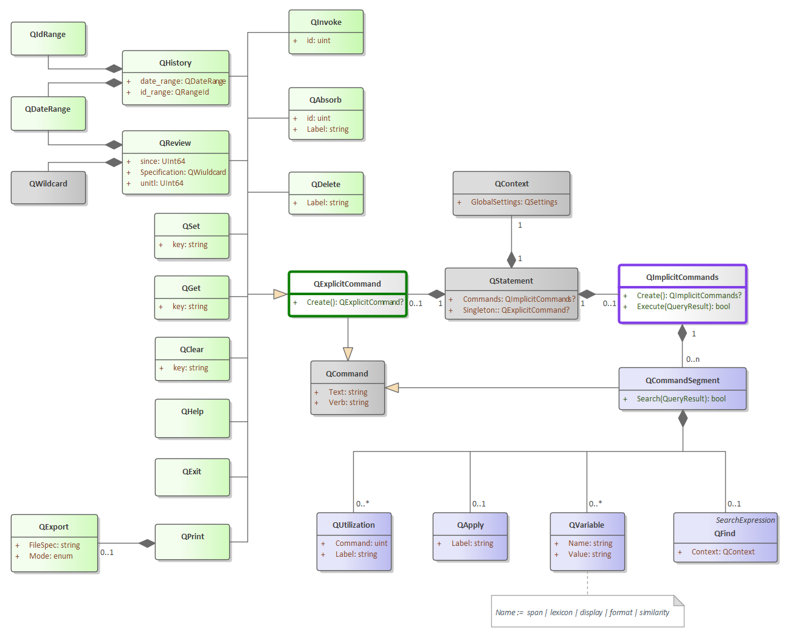
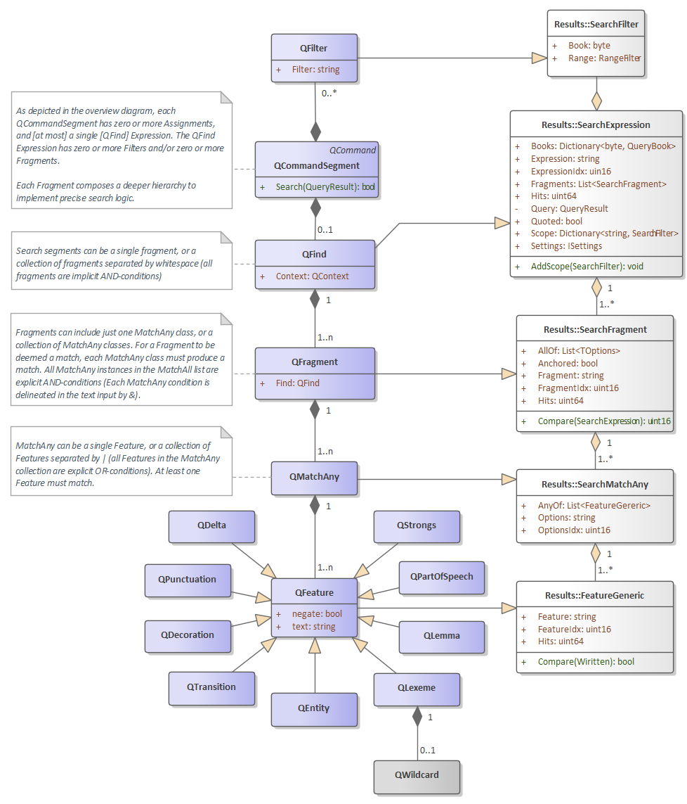
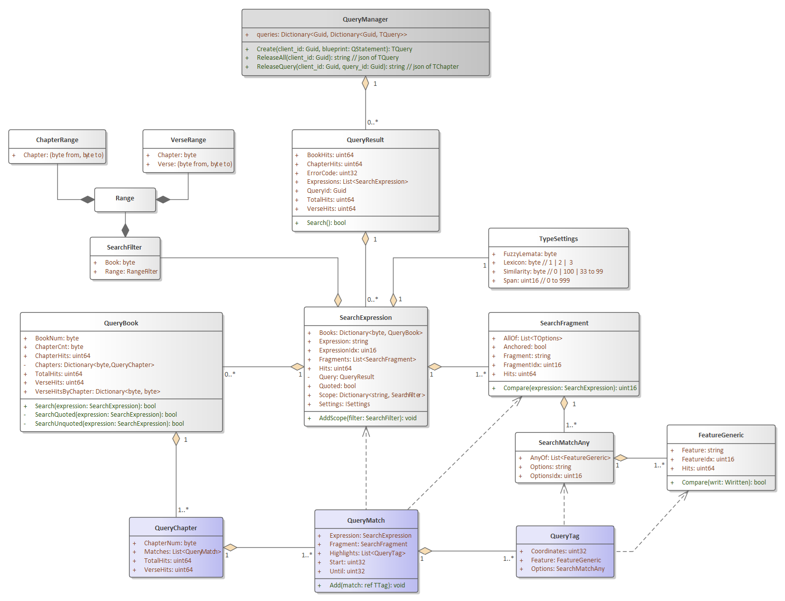

# Digital-AV native Framework

The Digital-AV is an SDK that exposes a digital representation of the Authorized Version of the bible. You may already know that the Authorized Version (AV) is the more proper name for the King James Version (KJV) of the bible. It was indeed <u>authorized</u> by King James. This is super significant in history: because prior to its authorization, bible translation into English and publication were against law in England. Underground translation and publication were punishable by death. Routinely, these executions were cruel and public. It's no secret that persecution was motivation for a small congregation to embark upon a dangerous voyage across the Atlantic on the Mayflower. These English men, women, and children, were previously living in exile. Prior to their voyage, they had fled to Holland to escape religious persecution. These brave souls sailed to the new world with their Geneva Bibles clutched in hand. 

Let's just say, "Authorization was a great thing!", and let's look at the bright side of living in our day. It's worthy to note: the AV/KJV bible is written in Elizabethan-English. Some just call it "Early Modern English". In any event, King James commissioned 47 translators of world renown. Contemporaries of Shakespeare, these 47 translators clearly identified their objective: "... ***to make GODS holy Trueth to be yet more and more knowen unto the people*** ..."  (in their own words, found in the introduction to the Authorized Version of 1611).

AVX is an abbreviation for **AV** e**X**tensions. Quintessentially, AVX-Framework has a digital representation of the AV bible at its core. The framework coordinates a variety of capabilities: the high-linguistic-fidelity of Digital-AV is exposed via a rich grammar called [AVX-Quelle](https://github.com/kwonus/Quelle/blob/main/Quelle-AVX.md). Quelle grammar is concise, intuitive, and useful. Moreover, Quelle syntax facilitates sounds-alike searching, searching by lemma, searching by part-of-speech, wildcard searching, and equivalence-mapping of Elizabethan-English to/from modern-English search terms.

The AVX Framework incorporates the Digital-AV, the Quelle command language, and computer source code to produce a framework (i.e. a library or DLL). The framework exposes not just the AV text itself, but also a multitude of linguistic features for each word contained within the text. In short, the framework provides the original AV text, rich linguistic features, and extensive search capabilities. Under the hood, Digital-AV fully encodes: Strong's numbers, Lemmatizations, Part-of-Speech tags, named-entity types, [NUPhone representation](https://github.com/kwonus/NUPhone/blob/main/NUPhone.md), dual lexical [text] representations via its unique bi-text lexicon. The framework makes all features exposed by the Digital-AV searchable; and it provides rendering and highlighting in a variety of formats (e.g. HTML, Markdown, YAML, and Text).

I have adopted the objective of the 47 original AV translators. Inspired by those before me, I want ***to make God's holy Truth to be yet more and more known!*** Four centuries later, it resonates as if it had been spoken only yesterday. While it is a lofty goal, I embrace it wholeheartedly! With all of the features of Digital-AV exposed via Quelle, it enables any user to stay primitive, or search with deep nuances of language. It finds bible verses, whether queries be simple or complex. Leveraging this framework, developers are empowered with an intuitive command language. Digital-AV manifests the most trustworthy English text that God has yet availed to mankind [The Authorized Version of 1611, with standardized spelling revisions of the 1769 edition].

The accuracy and trustworthiness of the AV is well documented by Edward F. Hills, in his book titled [The King James Version Defended](https://archive.org/details/TheKingJamesVersionDefended/mode/2up). Hills provides proof that the AV should be preferred by English speaking people everywhere. Application developers can trust the utility of AVX Framework, and place their focus on specific use-case scenarios and personas. With a license as free as the gospel, use it as you see fit (hopefully to the glory of God). The upcoming releases of AV-Bible will be built upon this foundation.

### Functional Overview

The Digital-AV native Framework offers unparalleled linguistic-search capabilities for the sacred text, in a fully native/compiled implementation. It is similar to a C# implementation known as AVX-Framework, but natively compiled without dotnet dependencies. Its fidelity of expression exceeds that found in most search-engines and command-languages. 

AV-Engine is the central point of access to the Digital-AV native Framework. This native SDK packs all of this information into a single compact binary file: it is fully indexed and its format is extensively [documented](https://github.com/kwonus/Digital-AV/blob/master/omega/Digital-AV-%CE%A951.pdf). TAV-Engine is the entry-point to the framework. The codebase consists almost entirely of multi-platform C++. However, a large chunk of command-parsing code is written in C#, that will remain and be accessed via a REST service. It utilizes a full-featured command language and extensive functionality:

- sounds-alike searching via NUPhone Representation and the companion NUPhone dotnet assembly
- ability to precisely render text, with metadata from search to accommodate term-highlighting of matched query tokens
- complete support for dual lexicons
- search by named entity type
- search by Strongs number
- search with detailed proximity rules
- rich command/search language via the Pinshot-Blue library and its PEG grammar.
- object-model representations of AVX dialect of the Quelle grammar via the Blueprint-Blue library
- AV-Engine library glues it all together

All of these search options are clearly detailed using a formal grammar as described in the [Quelle specification](https://github.com/kwonus/Quelle/blob/main/Quelle-AVX.md).

### Earlier Works

It's been a quarter century since the first release of AV-Bible for Windows. In its day, it was the world's first <u>free</u> bible software with a graphical user interface that ran on Microsoft Windows. It was originally released as: AV-1995, AV-1996, ... , until the final releases as AV-2008 & AV-2011. A companion software development kit (SDK) emerged along side AV-2008 and AV-2011. The SDK was renamed "Digital-AV" not long after its initial debut. Over the years, I developed a few freeware products on top of it. None were ever as significant as AV-Bible. The AV-Bible application name was resurrected in 2021 as a WPF application, built with the Digital-AV SDK. It is, has been, and always will be: free. 

With respect to the Digital-AV, you can rely on its foundation. With countless deployments and extensive text validation, Digital-AV has travelled the world and back with feedback from Christian missionaries, pastors, and lay people. They used it in their ministries. In return, I received treasured quality-control feedback. By 2008, all of the textual bugs were ironed out. Not coincidentally, 2008 was the first release of the SDK. Never making a dime, and pouring a healthy chunk of my life into this effort: it has been a labor of love.

### What's next?

The Digital-AV native Framework represents a radical step forward, at the same time as it reaches back to its roots. It began in 1995 as a fast & lean KJV search tool for Windows (written in Microsoft C++ and Borland Delphi).  The modern framework is still fast & lean. They say, "The more things change, the more things stay the same." This cliche applies here. AV-Engine is back! Unlike the earlier AVX-Framework, it is natively compiled (this time with platform-portable C++). Once again, the GUI will be walled off from the engine. The GUI is still under investigation. A Swift implantation on Mac and a Flutter implementation on Windows are being considered. A multi-platform Qt C++ is also under consideration.  Initial implementation as a native web-app behind a hardened reverse-proxy is the most likely first implementation.

### Native Modularity *(and almost dependency free)*

The framework is highly modular. Incidentally, a modular architecture is much like a micro-service architecture, but rather than REST endpoints, invocations are made in-process. These in-proc invocations obviate the need for sophisticated plumbing and eliminate most serialization and deserialization. In-proc is also more performant than REST or even RPC. All said, a modular architecture with in-proc invocations, on the metal, is a solid foundation. The only dependency is the STL and the free RemObjects multi-platform Swift compiler.

All dependencies are self-contained and opaque. Nevertheless, modules that compose the Digital-AV native Framework, along with file dependencies, are depicted in Figure 1:

**Figure 1-1**: The Digital-AV native Framework overview [rev #5424]

Evidenced by Figure 1-2, serialization is used for parameters when crossing from Swift into native Rust. Parameter serialization, for in-proc cross-language invocation, is used in lieu more granular parameter-marshalling, because it is both more efficient and less fragile than marshalling. All other method invocations utilize POCO (plain old C++ objects). The table in Figure 2 identifies repository references, OS dependencies and/or runtime when applicable, and implementation/computer language of the library.

**Figure 1-2**: The Digital-AV native Framework external dependencies [rev #5424]

Evidenced by Figure 1-2, serialization is used for parameters when crossing from C# into native Rust. Parameter serialization, for in-proc cross-language invocation, is used in the Blueprint-Blue library.

The table in Figure 2-1 identifies repository references of the native framework, along with list of supported operating systems.

The table in Figure 2-2 identifies external dependencies of the native framework, along with list of supported operating systems.

| **Module**  *(repository)* source code folder            | Branch | Supported OS  | Language |
| ------------------------------------------------------------ | ------ | ------------- | -------- |
| **av-misc** *([github.com/kwonus/AV-Native-SDK/av-misc](https://github.com/kwonus/AV-Native-SDK/tree/main/av-misc))* Cross-Platform library *(miscellaneous utilities)* | main   | Mac & Windows | C/C++    |
| **nuphone** *([github.com/kwonus/AV-Native-SDK/nuphone](https://github.com/kwonus/AV-Native-SDK/tree/main/nuphone))* | main   | Mac & Windows | C/C++    |
| **av-blueprint** *([github.com/kwonus/AV-Native-SDK/av-blueprint](https://github.com/kwonus/AV-Native-SDK/tree/main/av-blueprint))* dependency: Blueprint-Blue-SVC | main   | Mac & Windows | C/C++    |
| **av-search** *([github.com/kwonus/AV-Native-SDK/av-search](https://github.com/kwonus/AV-Native-SDK/tree/main/av-search))* | main   | Mac & Windows | C/C++    |
| **av-engine** *([github.com/kwonus/AV-Native-SDK/av-engine](https://github.com/kwonus/AV-Native-SDK/tree/main/av-engine))* | main   | Mac & Windows | C/C++    |
| **AV-2025** UI *(TBD)*                                       | main   | Mac & Windows | Flutter  |

**Figure 2-1**: The Digital-AV native Framework input and output definition and repository details [rev #5426]

| **Module**  *(repository)* source code folder            | Branch | Supported OS  | Language |
| ------------------------------------------------------------ | ------ | ------------- | -------- |
| **Digital-AV** *([github.com/kwonus/Digital-AV](https://github.com/kwonus/Digital-AV))* Binary file that can be used to instantiate objects via deserialization | master | Mac & Windows | any      |
| **av-foundations** *([github.com/kwonus/Digital-AV/omega/foundations/c](https://github.com/kwonus/Digital-AV/tree/master/omega/foundations/c))* Cross-Platform functional access the the Digital-AV binary | main   | Mac & Windows | C/C++    |
| **xvmem** *([github.com/kwonus/XVMem](https://github.com/kwonus/XVMem))* Cross-Platform compatible shared-memory library | master | Mac & Windows | C/C++    |
| **Blueprint-Blue-SVC** *([github.com/kwonus/Blueprint-Blue](https://github.com/kwonus/Blueprint-Blue))* ASP-MVC wrapper around Blueprint-Blue-Lib | main   | Windows (x64) | C#       |
| **Blueprint-Blue-Lib** *([github.com/kwonus/Blueprint-Blue](https://github.com/kwonus/Blueprint-Blue))* Converts S4T parses into an object model *(miscellaneous utilities)* | main   | Windows (x64) | C#       |
| **pinshot-blue** *([github.com/kwonus/pinshot-blue](https://github.com/kwonus/pinshot-blue))* Search-for-Truth (S4T) PEG-based parser | main   | Windows (x64) | Rust     |

**Figure 2-2**: External Dependencies of the Digital-AV native Framework [rev #5426]

### Internals

The Digital-AV native Framework simplifies access to the [Digital-AV SDK](https://github.com/kwonus/Digital-AV/blob/master/omega/Digital-AV-%CE%A951.pdf). The SDK provides NLP and linguistic features of the King James Bible. To be clear, the Digital-AV is what makes searches and rendering in the AVX-Framework, both feasible and fast. AVX-Lib is compiled with Dotnet 8.  AVX-Lib leverages the latest "Omega" release of Digital-AV. The Omega release exposes the entire SDK in a single binary file that includes a built-in index/directory (the earlier "Z-Series" release of Digital-AV was far more cumbersome. There were numerous files and a lot more provisioning steps that were placed upon the consumer of the SDK). In short, AVX-Lib is a component of the Digital-AV SDK, and is designed specifically to simplify its use. To be clear, when we say "consumer", there is no implied cost. All components of the AVX Framework are as free as the gospel.

### nuphone internals

[nuphone](https://github.com/kwonus/NUPhone) is an MIT-licensed open source library. Its reference implementation, used here, is an in-process native library. It emerged while Kevin was pursuing a masters in Computational Linguistics from the University of Washington (UW). In his coursework, he implemented a cross-lingual approximate string-matching algorithm between French text and English text. He called his comparison logic, "the heads & tails algorithm". It prioritized matching with a bias toward either the beginning string segment, or ending string segment. A close match guided the next comparison by aligning and prioritizing subsequent comparison logic. This approximate match logic allowed for slightly-differing Roman orthographies.

NUPhone formalizes that algorithm and simultaneously embraces uncertainty in its formalism. NUPhone is part acronym and part blend, It stands for "<u>N</u>ormalized-<u>U</u>ncertainty <u>Phone</u>me" representation. Like the heads & tails algorithm, NUPhone incorporates an abbreviated phonetic inventory. Yet, the NUPhone representation utilizes only 8-bits per phoneme. In general, that is more compact than ASCII, because many English phonemes are represented by more than a single character. Cooler still, those 8-bits represent a tiny coordinate system. Using this manner of representation, sound similarity can be efficiently calculated with Manhattan-Distance. Things couldn't be more intuitive. Phoneme embeddings in only 8-bits, coverage of the full phonetic inventory for English, and the efficiency of fuzzy-comparisons without the overhead of floating-point arithmetic!

### av-blueprint

[av-blueprint](https://github.com/kwonus/AV-Native-SDK/tree/main/av-blueprint) is a C++ library that is a wrapper around a REST service that is implemented in C# and dotnet 8. The service serializes all objects to YAML. In turn the Blueprint-Blue-SVC service depends on a native Rust library. Blueprint-Blue-Lib handles the P/Invoke calls into the Rust library [Pinshot-Blue]. Those layers are opaque to callers of av-blueprint and together the stack produces an object model (aka blueprint) from the parse tree. The OO model/blueprint is depicted in Figure 3-1. All green objects in the diagram relate to explicit Quelle commands. All purple objects in the diagram relate to implicit Quelle commands (search expressions are merely a component of an implicit Quelle command). All gray objects are neutral or shared.

**Figure 3-1**: Overview of the Blueprint-Blue object model (a framework that represents a [Quelle](https://github.com/kwonus/Quelle/blob/main/Quelle-AVX.md) parse)

The QFind object depicted above is almost a framework in itself. Figure 3-2 provides a detailed view of the QFind hierarchy. It should be noted that AV-Engine handles all Quelle commands except QFind [find expressions] without assistance from AV-Search. However, search expressions invoke methods in AV-Search and sport a leaner object model that better accommodates serialization for future web clients.

**Figure 3-2**: Detail of the QFind class of the Blueprint-Blue object model [rev #4111]

### av-search internals

After a command is converted into a blueprint, that blueprint is handed off to av-search, which returns search results as represented by the purple boxes of Figure 3-3.

As seen in Figure 3-2, the QFind class inherits from SearchExpression. Most levels inherit from the result objects for easier interop between av-blueprint and av-search with av-engine.  The full QueryResult object hierarchy, depicted in Figure 3-3, streamlines rendering and highlighting operations for downstream clients of av-engine. All calls from av-engine to av-search are in-process.

Figure 3-3 reveals the entire QueryResult hierarchy. The purple objects offer both a summary of search results simultaneously with per-chapter results with metadata for highlighting and rendering.  The Dark Gray box is not part of the Query itself; instead, it manages access to instantiated queries. The design is forward looking for when av-engine sits behind a REST service. The QueryManager is not currently implemented in the in-proc implementations.

**Figure 3-3**: QueryBook exposes summary information <u>and</u> hierarchical details for rendering & highlighting [rev #5415]

### av-engine internals

av-engine is a native library, implemented in C++. Once a Quelle object model (aka blueprint) is obtained for the search from the av-blueprint library, it is passed to av-search. Additional details about the object-model can be found in the [Quelle-AVX specification](https://github.com/kwonus/Quelle/blob/main/Quelle-AVX.md).

### Development Roadmap

The GUI architecture is yet to be defined. The initial implementation is likely to be a C++ web app built with Crow, sporting a Caddy reverse Proxy. Nothing is currently cut in stone.

### Implementation Status

Everything on the roadmap is currently in flux. 

An App built atop the reference C# implementation is already available at the Microsoft Store. It is available [here](https://apps.microsoft.com/detail/9N83W16BTMTK).

All source-code can be found at https://github.com/kwonus. 

**The Lord gave the word: great was the company of those that published it. -- Psalm 68:11**
